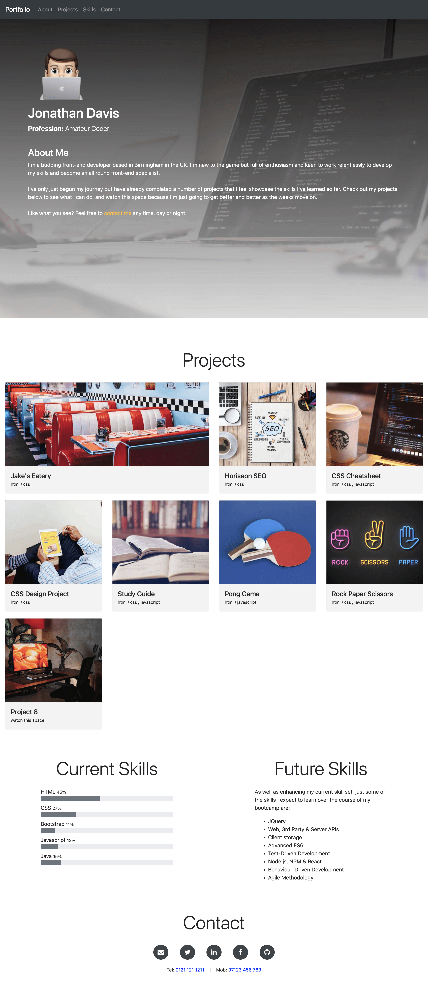

# Portfolio Page Challenge

## Description
- I was given the task of building from scratch a personal portfolio of work to showcase my skills and talents to potential employers.
- The page highlights my strongest work linking to deployed web applications.
- The site has been developed using the core skills I've recently learned: grids, flexbox, media queries and CSS variables.
- The page presents my name, an avatar and in-page links to to the following sections:
  - About
  - Projects
  - Skills
  - Contact links
- There is a navigation menu that is fixed to the top of the page. The links in the navigation scroll to the corresponding section when clicked.
- There is a "scroll to top button" fixed in the lower right corner of the page.
- The work section contains titled images of my projects/applications with the first application's image displaying larger in size than the others.
- When images of the applications are clicked the user is taken to that deployed application in a new browser tab/window.
- The site is responsive and when the page is resized, or viewed on various screens / devices, it adapts to the user viewport.
- The site contains a bar chart displaying the percentage of various coding languages that have been utilised in my projects (***NB. I am unable to share the VBA projects as they contain sensitive information***)

## Table of contents
- [Installation](#installation)
- [Usage](#usage)
- [Credits](#credits)
- [License](#license)

## Installation
N/A

## Usage
- [Link to deployed site](https://trunten.github.io/ubbc-portfolio-of-work/)
- Jump to each section on the page by clicking the links in the navigation bar
- Click on any of the project "tiles" to open up the deployed application in a new window/tab
- Scroll back to the top at any time by clicking on the "Top" button in the lower right corner
- Contact me through email, phone or any of my social media profiles using the links provided in the contact section (***disabled currently to avoid information leak***)
- Preview of the finished site:

## Credits
- Bar Chart - https://www.chartjs.org
- Email Icon - https://www.iconspng.com
- Twitter, LinkedIn & Facebook Icons - https://iconscout.com/contributors/pixel-icons
- GitHub Icon - https://iconscout.com/icons/developer-tool
- Project background images - https://unsplash.com
- https://stackoverflow.com/questions/10933837/line-break-like-br-using-only-css

## License
Please refer to the LICENSE (MIT) in the repo.
